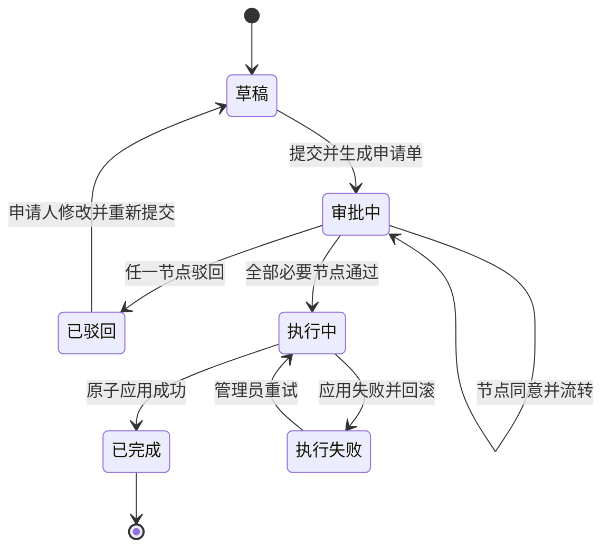
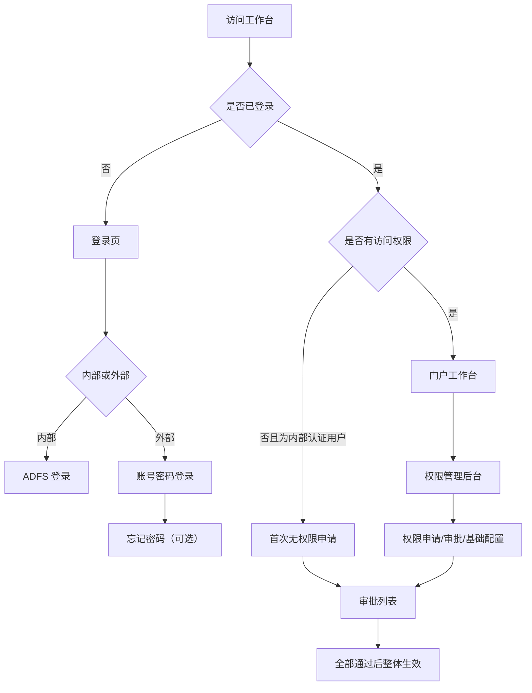

# 权限管理系统产品需求文档（PRD）

版本：v1.0（需求评审稿）
更新日期：2026-08-09
适用产品：联想乐享 AI 工作台权限管理
体验基线：当前 Vue POC、`docs/permission-poc-specs.md`、`docs/UI_SPEC.md`、`docs/UI_ACCEPTANCE.md`
文档用途：产品需求评审、前后端方案设计、接口联调、测试验收

## 1. 文档说明

### 1.1 事实分层

本文使用以下标记，避免把 POC 的演示实现误认为生产方案：

- **已确认规则**：已由产品讨论确认，研发与测试必须遵守。
- **POC 基线**：当前 POC 已呈现的内容、交互或 Mock 流程，生产实现应保持用户体验一致。
- **生产要求**：为了真实上线必须补齐的数据持久化、安全、并发、审计或接口能力。
- **待评审**：当前 POC 或讨论尚未给出唯一结论，评审后才能进入开发。

### 1.2 版本记录

| 版本 | 日期 | 说明 |
| --- | --- | --- |
| v1.0 | 2026-08-09 | 基于已完成 POC 汇总权限申请、审批、用户、角色、组织、菜单、数据源及外部用户找回密码需求 |

## 2. 项目背景与目标

当前 POC 已验证权限申请与权限管理的主要操作链路。本项目需要将 POC 固化为可评审、可研发、可验收的生产级需求，并确保三个权限范围入口及审批生效口径一致。

## 3. 产品范围

### 3.1 本期范围

1. 登录与账号访问：内部 ADFS 登录、外部账号密码登录、外部用户找回密码、内部用户首次无权限申请。
2. 权限申请：权限变更、创建账号、启用账号、禁用账号、重置密码五种申请类型。
3. 权限范围：所属租户、添加角色、复制他人角色、选择数据权限及最终权限差异校验。
4. 审批中心：待办筛选、申请详情、分节点审批、多业务负责人会签、整体生效、审批通知与审计记录。
5. 权限后台：角色管理、用户管理、组织管理、菜单管理、数据源管理。
6. POC Mock 数据、演示身份、流程数据与生产接口的映射说明。

### 3.2 非本期范围

1. 本期不重新设计“权限申请 → 重置密码”的字段；保留 POC 已有的本人身份验证与改密流程。
2. 不提供外部人员自助注册入口；外部账号由内部人员通过“创建账号”申请创建。
3. 不允许用户脱离角色获得用户级功能权限例外；用户级例外只包含数据权限。
4. 不在本 PRD 中确定组织系统、ADFS、短信、邮件、审批引擎等外部平台的供应商和采购方案。
5. 不改变门户工作台自身业务页面，只定义其目录、功能、数据集被权限系统引用的方式。

## 4. 用户角色与权限边界

| 角色 | 主要目标 | 核心能力 | 约束 |
| --- | --- | --- | --- |
| 内部申请人 | 为本人或他人申请权限/账号操作 | 发起五类申请、查看本人申请 | 申请人身份与直线经理由登录上下文带出 |
| 外部申请人 | 为本人或其他外部人员申请权限 | 发起权限变更、查看申请进度 | 无直线经理，必须通过关联人建立内部责任关系 |
| 被申请人 | 获得账号或权限 | 查看与本人相关的申请 | 默认不能修改审批中的申请 |
| 关联人 | 对外部人员关系负责 | 确认外部人员关系、审批 | 仅在外部人员链路出现；与内部申请人为同一人时可省略节点 |
| 申请人直线经理 | 判断申请合理性 | 审批，必要时调整权限范围 | 外部申请人无此节点 |
| 被申请人直线经理 | 判断内部被申请人权限范围 | 审批，必要时调整权限范围 | 仅“内部人员为其他内部人员申请”出现 |
| 业务负责人 | 对角色与业务归属负责 | 按本人负责角色审批并填写所属组织 | 多人会签，必须全部通过 |
| 系统管理员 | 维护用户与权限基础数据 | 用户管理、角色/组织/菜单/数据源管理、直接启停用户 | 用户管理内启停不走审批；权限申请中的启停仍由系统管理员审批 |
| 系统 | 执行与记录 | 生成单号、编排节点、通知、整体生效、审计 | 不得在部分审批通过时提前生效 |

## 5. 产品信息架构与入口

### 5.1 页面入口

| 页面 | POC 路由 | 访问方式 | 权限要求 |
| --- | --- | --- | --- |
| 登录页 | `/login` | 未登录访问 | 公开 |
| 内部 ADFS 登录 | `/adfs-login` | 登录页“内部用户登录” | 公开，生产接 ADFS |
| 首次无权限页 | `/access-denied` | 内部用户认证成功但无工作台权限 | 公开但必须具备已认证身份上下文 |
| 申请进度页 | `/account-request/status` | 通知链接 | 公开链接必须使用短期、不可猜测 token |
| 邮件审批确认页 | `/mail-approval/action` | 审批邮件链接 | 公开链接必须校验审批人身份及一次性 token |
| 权限管理后台 | `/agent/permissions` | 工作台用户菜单进入 | 登录且具备相应模块权限 |

### 5.2 权限后台模块

后台左侧模块固定为：权限申请、审批列表、角色管理、用户管理、组织管理、菜单管理、数据源管理。各模块是否可见、是否可编辑由后端下发的管理员权限控制，不能只由前端隐藏按钮实现。

## 6. 全局权限模型

### 6.1 名词定义

| 名词 | 定义 |
| --- | --- |
| 租户 | 权限生效的产品/业务空间，可多选；当前 POC 为 `leaibot-cn`、`shop-chat`、`b-chat`、`biz-chat` |
| 角色 | 功能权限与数据权限的可复用集合，并绑定业务负责人 |
| 功能权限 | 页面、功能、按钮或 Skill 的操作能力；用户有效功能只能由角色产生 |
| 数据权限 | 对数据集或自定义条件范围的访问能力 |
| 角色继承数据 | 角色中绑定的数据权限，随角色进入最终权限 |
| 用户级数据例外 | 只允许作用于数据权限，包括角色外的单独授权，以及在现有模型允许时对角色继承数据的抑制；不包含功能权限例外 |
| 权限快照 | 某一时点的租户、角色、有效功能、有效数据及来源的不可变记录 |
| 权限基线 | 权限变更流程开始时，被申请人的当前有效权限快照 |

### 6.2 核心不变量

1. 有效功能权限 = 手工角色范围内已勾选功能 ∪ 复制角色的完整功能；任何角色范围外的直接功能 ID 必须被丢弃。
2. 有效数据权限 =（角色继承数据 − 本次明确抑制的角色数据）∪ 复制用户的单独授权数据 ∪ 本次手工选择数据。复制他人权限不复制对方的抑制配置。
3. 相同权限来自多个来源时只产生一项有效权限，但审批详情和审计记录必须可解释其来源。
4. 租户、角色、功能、数据权限均使用稳定 ID 去重，展示顺序不影响差异比较。
5. 审批中的申请保存“基线快照 + 申请快照”；审批完成前不能覆盖用户当前有效权限。
6. 全部必要审批通过后，以一笔原子操作应用最终快照；失败时整笔回滚并进入“执行失败”状态。
7. 复制权限不复制租户、组织、账号资料，也不复制用户级功能权限。

### 6.3 权限范围标准数据结构

下列字段语义为前后端共同合同，字段命名可在技术评审中调整，但不可丢失等价信息：

```ts
interface PermissionScopeSnapshot {
  tenantIds: string[]
  selectedRoleIds: string[]
  selectedRoleFunctionPermissionIds: string[]
  copiedFromItcode: string | null
  copiedRoleIds: string[]
  copiedDataSourceMap: Record<string, '角色继承' | '用户单独授权'>
  manualDataPermissionIds: string[]
  suppressedRoleDataPermissionIds: string[]
  effectiveFunctionPermissionIds: string[]
  effectiveDataPermissionIds: string[]
}
```

后端必须重新计算并校验 `effectiveFunctionPermissionIds` 与 `effectiveDataPermissionIds`，不能直接信任前端计算结果。

## 7. 登录与访问控制

### 7.1 内部用户登录

1. 默认展示“内部用户登录”页签。
2. 点击“内网 ADFS 登录”后进入 ADFS；登录成功按原目标地址返回。
3. 已认证且有权限：进入原目标页或工作台首页。
4. 已认证但没有工作台访问权限：进入首次无权限页，不跳进权限管理后台。
5. 内部登录页不展示“忘记密码”，密码由企业身份系统管理。

### 7.2 外部用户登录

1. 切换“外部用户登录”后展示用户名、密码、“忘记密码”和“登录工作台”。
2. 用户名或密码为空时就近/集中提示，不发起登录请求。
3. 登录失败使用统一错误提示；不得透露账号是否存在、是否被禁用等敏感内部信息，具体原因写安全审计。
4. 登录页不展示可点击的注册入口；无账号外部用户由内部关联人发起“创建账号”。
5. 登录成功后清空内存中的明文密码。

### 7.3 外部用户忘记密码

#### 7.3.1 入口与步骤

仅外部登录页展示“忘记密码”。点击后打开“找回密码”模态框，分三步：身份验证 → 设置新密码 → 完成。

#### 7.3.2 身份验证

1. 自动带入登录页已填写的外部用户名，可修改。
2. 验证方式支持手机号、邮箱二选一；切换方式时清空联系方式、验证码和倒计时状态。
3. 手机号必须为 11 位中国大陆手机号格式；邮箱必须符合基本邮箱格式。
4. 点击“获取验证码”后显示统一反馈：“如账号信息匹配，验证码将发送至该手机号/邮箱，10 分钟内有效。”
5. 发送成功后开始 60 秒倒计时，倒计时内禁止重复发送。
6. 验证码为 6 位数字；未发送、格式错误、错误或过期均就近提示。
7. 验证通过后展示脱敏联系方式，并自动聚焦新密码输入框。

#### 7.3.3 设置密码与完成

1. 新密码至少 8 位；生产环境应复用统一密码强度策略，若统一策略高于 8 位，以统一策略为准。
2. 确认密码必填且必须一致。
3. 提交成功进入完成态；点击“返回登录”关闭弹窗、保留用户名、清空密码。
4. 关闭弹窗后焦点返回“忘记密码”入口；Esc、遮罩关闭和 Tab 焦点圈定遵循标准模态框规则。

#### 7.3.4 安全要求

1. 验证码只存储摘要，10 分钟过期、单次使用；同一用户名/联系方式/IP/设备均需限流。
2. 连续失败达到阈值后短时冻结，具体阈值由安全评审确定。
3. 验证成功返回短时、一次性 recovery token；改密成功立即失效。
4. 改密后撤销该外部账号已有登录会话，并记录账号、渠道、IP、设备、时间和结果。
5. 接口响应不得帮助攻击者枚举用户名或绑定联系方式。

## 8. 首次无权限访问申请

### 8.1 使用场景

内部用户已通过 ADFS 认证，但尚无工作台权限。页面原地完成申请，不另行创建账号，也不跳转后台。

### 8.2 页面步骤

1. 基本信息：申请人 ITCode、申请人直线经理自动带出且只读；手机号、邮箱、申请原因选填。
2. 权限范围：复用第 10 章统一权限范围组件。
3. 确认并提交：只展示审批流程和整体生效说明，不展示冗长差异明细。
4. 提交成功：展示申请单号、当前状态和审批路径。

### 8.3 规则

1. 所属租户至少选择 1 项；角色和数据权限均可不选。
2. 初始权限基线为空，不执行“必须发生权限变化”校验。
3. 审批链为申请人直线经理 → 全部业务负责人 → 系统自动生效。
4. 任何业务负责人尚未通过时，不得提前开通部分权限。
5. 重复提交应返回当前有效申请单，不创建同一用户的重复待审申请。

## 9. 权限申请

### 9.1 通用页面结构

| 申请类型 | 步骤 |
| --- | --- |
| 权限变更 | 选择类型 → 填写信息 → 权限范围 → 审批执行 |
| 创建账号 | 选择类型 → 填写信息 → 权限范围 → 审批执行 |
| 启用账号 | 选择类型 → 填写信息 → 审批执行 |
| 禁用账号 | 选择类型 → 填写信息 → 审批执行 |
| 重置密码 | 选择类型 → 身份验证 → 重置完成 |

切换申请类型时必须清空上一类型的人员信息、权限范围、错误和临时验证状态，不能把上一申请的租户或权限带入下一申请。

### 9.2 填写信息字段矩阵

`自动带出`字段只读；`必填`字段为空时阻止进入下一步；`选填`字段为空不报错。人员类型或申请类型切换后，隐藏字段不校验、不提交、不在审批详情回显。

#### 9.2.1 权限变更（内部人员）

| 顺序 | 字段 | 规则 |
| --- | --- | --- |
| 1 | 申请人用户名/ITCode | 当前登录用户自动带出，只读 |
| 2 | 被申请人 ITCode | 必填 |
| 3 | 被申请人手机号 | 选填 |
| 4 | 被申请人邮箱 | 选填 |
| 5 | 申请人直线经理 | 自动带出，只读 |
| 6 | 被申请人直线经理 | 必填，可编辑/由人员目录查询带出 |
| 7 | 申请原因 | 必填 |

#### 9.2.2 权限变更（外部人员）

| 顺序 | 字段 | 规则 |
| --- | --- | --- |
| 1 | 申请人用户名/ITCode | 当前登录用户自动带出，只读 |
| 2 | 被申请人用户名 | 必填 |
| 3 | 关联人 ITCode | 必填 |
| 4 | 被申请人手机号 | 选填 |
| 5 | 被申请人邮箱 | 选填 |
| 6 | 申请人直线经理 | 内部申请人自动带出；外部申请人不展示 |
| 7 | 申请原因 | 必填 |

#### 9.2.3 创建账号

创建账号固定创建外部账号，必须同时申请初始权限范围。

| 顺序 | 字段 | 规则 |
| --- | --- | --- |
| 1 | 申请人用户名/ITCode | 当前登录用户自动带出，只读 |
| 2 | 被申请人用户名 | 必填，不能与申请人相同 |
| 3 | 设置密码 | 必填；生产应优先改为激活链接设置密码，见待评审项 |
| 4 | 确认密码 | 必填且与设置密码一致 |
| 5 | 关联人 ITCode | 必填，可编辑 |
| 6 | 被申请人手机号 | 选填 |
| 7 | 被申请人邮箱 | 选填 |
| 8 | 申请人直线经理 | 自动带出，只读 |
| 9 | 申请原因 | 必填 |

#### 9.2.4 启用/禁用账号（内部人员）

| 顺序 | 字段 | 规则 |
| --- | --- | --- |
| 1 | 申请人用户名/ITCode | 自动带出，只读 |
| 2 | 被申请人 ITCode | 必填 |
| 3 | 被申请人手机号 | 选填 |
| 4 | 被申请人邮箱 | 选填 |
| 5 | 申请原因 | 必填 |

#### 9.2.5 启用/禁用账号（外部人员）

| 顺序 | 字段 | 规则 |
| --- | --- | --- |
| 1 | 申请人用户名/ITCode | 自动带出，只读 |
| 2 | 被申请人用户名 | 必填 |
| 3 | 关联人 ITCode | 必填 |
| 4 | 被申请人手机号 | 选填 |
| 5 | 被申请人邮箱 | 选填 |
| 6 | 申请原因 | 必填 |

### 9.3 权限变更

1. 确定被申请人后读取其当前有效权限，作为本次表单不可变基线。
2. 权限范围初始状态回显基线租户、角色、角色内已选功能和数据权限。
3. 最终提交时按稳定 ID、去重、排序后的集合比较租户、角色、有效功能、有效数据与数据例外。
4. 仅打开弹窗、搜索、调整顺序、选择后恢复原状或复制后最终结果相同，不算变更。
5. 无变化时禁止创建申请单，提示：`未检测到权限变更，请返回权限范围调整所属租户、角色或数据权限后再提交。`
6. 有变化时系统生成申请单号，保存基线与提议快照，并进入审批列表。

### 9.4 创建账号

1. 被申请人固定为外部人员，不展示人员类型切换。
2. 关联人负责外部账号的业务关系；外部人员无直线经理。
3. 权限范围基线为空，至少选择 1 个租户，角色和数据可不选。
4. 审批全部通过前账号不可登录；全部通过后原子创建账号并应用权限。
5. 用户名冲突、账号已存在或同一目标存在待审创建申请时，禁止重复提交并提供可恢复提示。

### 9.5 权限申请中的启用/禁用

1. 启用和禁用不展示权限范围步骤。
2. 不展示或填写申请单号；提交时系统自动生成。
3. 审批链为申请人提交 → 系统管理员审批 → 系统执行。
4. 启用仅恢复账号状态，不擅自恢复已被清理的权限；如需权限应另行发起权限变更。
5. 禁用后立即阻止新登录，并按安全策略撤销已有会话；保留权限快照和审计记录。

### 9.6 重置密码

1. 仅允许当前用户本人操作，不进入审批列表。
2. 支持旧密码验证或绑定手机号/邮箱验证。
3. 完成后展示成功状态并记录安全审计。
4. 本次不调整其既有字段和步骤；外部登录页“忘记密码”是未登录状态下的独立入口。

## 10. 统一权限范围

### 10.1 适用场景

以下三个场景必须使用同一组件、同一目录数据、同一状态结构、同一合并及校验方法：

1. 首次访问页的权限范围选择。
2. 进入系统后权限变更时的权限范围选择。
3. 进入系统后创建账号时的权限范围选择。

除初始基线和“权限变更必须有变化”校验外，三个场景不允许存在其他交互差异。

### 10.2 固定页面顺序

1. 步骤标题与说明。
2. `所属租户`多选，必填，至少选择 1 项。
3. 操作按钮：`添加角色`、`复制他人角色`、`选择数据权限`。
4. 已选权限来源区：手工添加角色、复制他人角色、手工选择数据权限。
5. 字段错误与步骤操作区。

三个按钮均非必选；没有角色或数据权限时展示中性空态“角色和数据权限可按需添加”，不能展示错误。

### 10.3 添加角色

1. 弹窗为“角色列表 + 角色详情”双栏，打开后聚焦搜索框，并默认展示已选或第一个角色详情。
2. 角色详情包含功能权限、数据权限两个页签；功能权限沿用“一级目录 → 页面 → 功能”，数据权限使用“一级目录 → 数据集”。
3. 勾选角色时默认带入该角色全部功能权限和角色数据权限。
4. 手工角色的功能权限可在该角色绑定范围内取消或恢复；勾选某项功能时自动勾选角色。
5. 取消某项功能不自动取消角色；取消角色后清理不再由其他已选/复制角色提供的功能和数据。
6. 复制带入的角色及其功能、数据在弹窗中选中并锁定，不能修改。
7. 用户管理中的“添加角色”与权限申请完全复用以上交互，包括搜索、默认详情、角色联动、功能勾选、数据勾选、确认后焦点恢复。

### 10.4 复制他人角色

1. 输入 ITCode 查询可复制对象；为空、格式错误、查无此人、接口失败均就近提示且不改变现有选择。
2. 复制内容：对方当前有效角色、角色对应功能权限、角色对应数据权限、对方用户单独授权的数据权限。
3. 不复制：租户、组织、账号资料、用户级功能权限、角色外的功能覆盖或压制配置。
4. 复制结果整体只读，不允许删除、局部取消或更换来源。
5. 一次申请只能复制一个人；复制完成后入口进入禁用/完成态。
6. 复制后仍可手工添加角色和数据权限；最终结果按稳定 ID 去重。
7. 审批详情必须标明复制对象，以及每项数据权限是“角色继承”还是“用户单独授权”。

### 10.5 选择数据权限

1. 所有选择与回显统一为“一级目录 → 数据集”两层，不展示页面或二级菜单。
2. 一级目录与门户工作台左侧一级目录一致；首次打开全部默认展开，可手动折叠。
3. 数据集直接显示原始名称，不添加目录、类型、地域等前缀或后缀。
4. 每个一级目录右侧都有搜索图标；点击后展开当前目录、显示搜索框并自动聚焦。
5. 搜索仅按当前目录的数据集名称实时模糊匹配，各目录搜索状态互不影响。
6. 搜索、无结果、关闭搜索不能丢失已选数据；关闭搜索同时清空当前目录关键词。
7. 无结果时仅在当前目录显示“暂无匹配的数据集”。
8. 复制带入的数据权限在选择器中保持选中、锁定并显示来源；手工数据可调整或删除。
9. 同一展示规则适用于权限申请、用户管理、审批回显、角色新增/编辑/详情。

### 10.6 加载与错误状态

1. 租户、角色或权限目录加载中时禁止确认/提交，防止以不完整目录生成快照。
2. 目录加载失败时提供重试，保留其他已完成选择。
3. 长名称允许换行或省略，但必须能通过详情或 title 查看完整内容。
4. 子弹窗内容超高时主体滚动，标题与底部操作始终可达。
5. 从审批弹窗打开三个权限选择器时，子弹窗和遮罩必须位于审批弹窗上层；关闭子弹窗不关闭审批弹窗、不清空审批草稿。

## 11. 审批中心

### 11.1 审批链计算

| 场景 | 节点顺序 |
| --- | --- |
| 内部用户为自己申请权限 | 申请人直线经理 → 全部业务负责人 → 系统自动生效 |
| 内部用户为其他内部用户申请 | 申请人直线经理 → 被申请人直线经理 → 全部业务负责人 → 系统自动生效 |
| 内部用户为外部用户申请/创建账号 | 关联人（与申请人相同时省略）→ 申请人直线经理 → 全部业务负责人 → 系统自动生效 |
| 外部用户为自己申请 | 关联人 → 全部业务负责人 → 系统自动生效 |
| 外部用户为其他外部用户申请 | 被申请人关联人 → 全部业务负责人 → 系统自动生效 |
| 权限申请中的启用/禁用 | 系统管理员审批 → 系统执行 |

普通权限变更不生成系统管理员最终审批节点。角色为空时没有业务负责人任务，前序节点全部通过后直接进入系统自动生效。

### 11.2 审批列表

1. 支持按状态、审批人 ITCode、处理人多选筛选，支持重置。
2. 申请人/被申请人视角只读；当前审批人视角显示“审批”，其他可见申请显示“详情”。
3. 列表至少展示申请单号、申请类型、申请人、被申请人、本次变更摘要、当前节点、状态、提交时间和操作。
4. 邮件或进度页深链进入时，按申请单号定位并校验当前用户可见性。
5. 空结果提供清空筛选或返回全部的恢复操作。

### 11.3 审批详情与操作

1. 只读展示申请信息、人员关系、审批路径、基线与本次变更摘要、完整权限范围、审批日志。
2. 关联人审批：确认或驳回外部人员关系。
3. 申请人/被申请人直线经理审批：可在审批前调整租户、添加角色、复制他人角色、选择数据权限；调整后重新生成最终快照和业务负责人任务。
4. 业务负责人审批：权限范围只读；同意时必须选择本人负责角色的所属组织，可填写意见。
5. 审批结果必须选择“同意”或“驳回”；意见是否必填由第 20 章待评审项确定。
6. 驳回后状态为“已驳回/申请人修改”，不执行任何权限变更。

### 11.4 多业务负责人会签

1. 按最终角色的业务负责人去重生成任务；同一负责人负责多个角色时合并为一项任务并列出角色清单。
2. 各负责人并行处理，互不覆盖；列表显示剩余待审人数与各自状态。
3. 任一负责人驳回，整单驳回；已通过节点保留日志，不产生部分权限。
4. 全部负责人通过后，所属组织取各负责人选择结果的去重并集。
5. 最后一名负责人通过后触发一次系统执行；重复回调不能重复生效。

### 11.5 状态机与整体生效



生产状态必须包含“执行中/执行失败”，不能把审批通过直接等同于权限已生效。执行接口需使用申请单号作为幂等键，并保存生效前后快照。

### 11.6 通知

1. 提交后通知申请人、被申请人（适用时）、当前节点审批人。
2. 节点流转后只通知新待办审批人；会签阶段分别通知各业务负责人。
3. 驳回、完成、执行失败均通知申请人；创建账号完成时通知关联人和被申请人。
4. POC 使用本地 Mock 邮件收件箱与链接；生产使用真实邮件/消息中心，模板需通过产品与安全评审。
5. 邮件审批操作必须二次确认、校验当前节点和操作人，并防止链接重复执行。

## 12. 用户管理

### 12.1 使用对象与页面

仅系统管理员使用。列表支持按账号、姓名等条件筛选，操作为编辑、启用/禁用、详情；不再提供独立“设置角色”或“分配数据权限”入口。

统一用户工作区包含：基本信息、已分配角色、数据权限、历史变更、登录日志。详情为同一工作区只读态，可进入编辑。

### 12.2 基本信息

#### 内部人员

- 人员类型：必填。
- 用户 ITCode：必填。
- 用户直线经理：必填。
- 手机号、邮箱：选填。
- 有效期：必填。
- 所属组织：选填、多选。
- 备注：选填。

#### 外部人员

- 人员类型：必填。
- 用户名：必填。
- 关联人 ITCode：必填。
- 手机号、邮箱：选填。
- 有效期：必填。
- 所属组织：选填、多选。
- 备注：选填。

不展示“用户显示名称”“用户账号”“内部 AD 账户”“是否绑定 ITCode”。底层用户 ID 由系统生成；列表展示名默认取用户 ITCode/用户名对应的人员姓名，无法获取时回退为 ITCode/用户名。

### 12.3 租户与权限

1. 所属租户是权限范围，必填、多选，不属于直接保存的基本信息。
2. “添加角色”复用第 10.3 节完整交互；不得做用户管理专用简化版本。
3. 数据权限分为普通授权与自定义授权；普通授权使用一级目录数据集，自定义授权按菜单、条件组和条件配置。
4. 角色、角色内功能勾选、角色数据抑制、用户单独数据、自定义数据规则均纳入权限差异。
5. 用户级功能例外不存在；禁止在用户管理创建角色外功能授权。

### 12.4 保存与审批双轨

| 变更内容 | 处理方式 | 生效时机 |
| --- | --- | --- |
| 联系方式、有效期、所属组织、备注 | 系统管理员直接保存 | 保存成功后立即生效 |
| 所属租户、角色、角色内功能、数据权限 | 自动生成权限变更申请 | 全部审批通过并执行成功后生效 |
| 同时修改基本信息与权限 | 基本信息直接保存；权限保存为待生效快照 | 两部分分别按上述时机生效 |

权限变更不展示“审批单号”输入框；提交后生成新单号并进入审批列表。审批驳回不回滚已经成功保存的基本信息。

### 12.5 待审锁定

同一用户存在用户管理来源的待审权限变更时：

1. 租户、角色、数据权限区域只读，不能重复提交。
2. 显示正在审批的申请单号，并可跳转审批详情。
3. 基本信息仍可编辑保存。
4. 审批通过后一次性应用待生效快照；事件重复投递时只应用一次。

### 12.6 管理员直接启用/禁用

1. 列表点击启用/禁用后打开二次确认弹窗。
2. 操作原因必填；确认后立即改变账号状态，不生成申请单、不进入审批列表。
3. 记录操作者、目标用户、原状态、新状态、原因、时间、IP/设备和执行结果。
4. 禁用立即阻断登录并撤销会话；启用不自动新增或恢复权限。

### 12.7 历史与登录日志

1. 历史变更记录时间、类型、申请单号（如有）、变更摘要、操作者和结果。
2. 登录日志支持全部/成功/失败筛选，展示时间、结果、IP、设备、入口和失败原因。
3. 普通管理员查看登录失败原因时应按安全权限脱敏。

### 12.8 长期未登录 admin 权限治理

POC 展示“自动巡检、提前提醒、到期清理”的能力。生产规则暂定为：连续 3 个月未成功登录权限后台的 admin 角色账号进入清理候选，清理角色及用户级数据授权，并提前通知；具体计算口径、豁免名单、通知提前量、是否需要审批属于待评审项，未确认前不得自动在生产执行。

## 13. 角色管理

### 13.1 列表与筛选

列表展示业务负责人、角色组、角色名称、用户数、描述和操作，支持筛选与重置。操作包括查看、编辑、删除，系统内置角色应有清晰标识。

### 13.2 新增/编辑/查看

1. 基本信息：角色名称、角色类型、角色组、业务负责人、敏感性必填，角色描述按页面校验。
2. 功能权限：按“一级目录 → 页面 → 功能”选择，可搜索、展开/收起。
3. 数据权限：普通授权按“一级目录 → 数据集”，默认展开并支持目录内搜索；自定义授权按菜单配置条件组。
4. 查看态复用同一编辑器但全部只读；可点击“进入编辑”。
5. 保存时后端校验业务负责人有效、权限 ID 存在、用户无越权编辑能力。

### 13.3 删除

1. 删除前展示影响用户数和依赖情况并二次确认。
2. 内置角色或仍被用户/待审申请引用的角色禁止直接删除。
3. 生产建议采用停用/软删除；历史申请和审计中的角色名称、负责人、权限快照必须保留。

## 14. 组织管理

1. 以组织树展示上级、当前组织、子组织和成员，支持按组织名称、编码、负责人搜索。
2. 新增组织字段：租户、组织名称、上级组织必填；负责人、创建人、组织编码、描述按页面规则填写。
3. 编辑时上级组织和编码的可修改范围由后端约束；禁止形成循环层级。
4. 组织详情展示基础信息与成员；成员支持新增、编辑、移除，并配置组织角色、权限身份和状态。
5. 删除存在子组织、成员、角色或待审申请引用的组织时必须阻止；生产使用软删除并保留引用。

## 15. 菜单管理

### 15.1 权限层级

菜单管理维护“目录 → 菜单（页面）→ 功能”的功能权限树。功能类型包括功能、按钮、Skill；数据权限树不复用这里的页面层级。

### 15.2 操作

1. 列表支持按名称、所属目录、类型筛选并查看详情。
2. 新增/编辑菜单：所属目录、菜单名称、菜单路由、排序、描述必填；同级名称和路由不能重复。
3. 新增/编辑功能：所属菜单、功能名称、功能类型、描述和至少一个完整接口配置必填。
4. 接口配置支持排序、接口名称、接口地址多行维护。
5. 目录/菜单被功能、角色或申请快照引用时禁止物理删除；功能仍被角色或用户引用时禁止直接删除。

## 16. 数据源管理

### 16.1 列表

支持按目录、名称、类型等条件筛选，展示数据源名称、类型、接口地址、权限参数和操作。操作包括新增、编辑、删除、详情。

### 16.2 新增/编辑字段

| 字段 | 规则 |
| --- | --- |
| 所属一级目录 | 必填；只能选择门户功能目录树的一级根节点 |
| 名称 | 必填 |
| 接口地址 | 必填 |
| 权限参数 | 必填 |
| Key / Value | 选填，按具体授权参数使用 |
| 敏感性 | 选填/默认值由系统配置 |
| 备注 | 选填，最多 120 字 |

所有用户可见提示、校验和详情统一使用“所属一级目录”，不再使用“所属一级目录/大菜单”。保存时 `menu`、`group` 统一记录一级目录稳定 ID 与名称；既有二级目录数据迁移时归一到对应一级目录。

### 16.3 删除与引用

数据源被角色、用户、待审申请或历史快照引用时不能物理删除。生产采用停用/软删除，停用后不允许新选，但历史快照仍可回显名称。

## 17. 跳转与回退规则



1. 未登录访问受保护路由时跳登录页，并携带原 `redirect`；登录成功返回原地址。
2. 表单“上一步”保留已填字段、权限选择和错误恢复状态；切换申请类型才重置不兼容数据。
3. 申请成功后可通过申请单号进入详情；浏览器刷新后从后端恢复状态，不能依赖前端内存。
4. 邮件深链失效、越权或已处理时进入明确状态页，不跳空白页。
5. 关闭权限子弹窗后恢复触发按钮焦点；关闭外层审批弹窗才离开审批草稿。

## 18. Mock 数据与演示流程

### 18.1 登录与找回密码 Mock

| 项目 | Mock 值 | 用途 |
| --- | --- | --- |
| 外部用户名 | `external-demo` | 演示外部登录与找回密码 |
| 手机号 | `13800138000` | 手机验证演示 |
| 邮箱 | `external@example.com` | 邮箱验证演示 |
| 验证码 | `246810` | 仅 preview 模式显示和校验 |
| 新密码示例 | `Password1` / `Demo@1234` | 仅用于交互演示，不代表生产默认密码 |

生产环境必须关闭 preview 验证码、Mock 登录兜底和本地会话注入。

### 18.2 权限目录 Mock

| 类别 | Mock 数据 |
| --- | --- |
| 租户 | `leaibot-cn`、`shop-chat`、`b-chat`、`biz-chat` |
| 数据一级目录 | 乐享运营、GEO 看板、企业客户管理 |
| 角色 | 运营分析 PM、商品运营、GEO 分析师、线索运营、admin、外包协作 |
| 复制对象 | `wangxt8` 王晓婷、`liwen08` 李雯、`temp-bpo` 外部协作账号 |

`wangxt8` 用于核心验收：复制两个角色（运营分析 PM、GEO 分析师），有效功能为两个角色的 4 项去重并集，并包含“会员等级”用户单独数据授权；不得带入 Skill 管理功能、租户、组织或账号资料。

### 18.3 申请与身份 Mock

POC 内置申请单用于演示关系确认、直线经理审批、业务负责人会签、完成和驳回状态，例如 `AP-20260713-001`、`AP-20260713-002`、`AP-20260713-003`。POC 的固定时间、固定单号增长方式、本地邮件收件箱和 `localStorage` 同步只服务演示，生产必须替换为服务端时间、全局唯一单号、数据库与真实通知。

### 18.4 推荐演示路径

1. 首次访问：访问 `/access-denied?itcode=qa-first` → 基本信息 → 仅选择租户或复制 `wangxt8` → 提交 → 查看申请单号。
2. 权限变更无变化：选择权限变更 → 被申请人 `zhangrui32` → 不改变最终权限 → 提交被拦截。
3. 权限变更有效变化：新增租户、角色、数据或复制 `wangxt8` 任一项 → 提交成功进入审批列表。
4. 创建账号：填写外部用户名、两次密码、关联人 → 选择租户 → 提交。
5. 审批弹窗：依次打开添加角色/复制他人角色/选择数据权限，验证子弹窗位于最上层。
6. 用户管理：只改手机号直接保存；改租户/角色后自动生成申请单；待审期间权限区锁定。
7. 用户启停：填写原因直接禁用，审批列表数量不增加。
8. 找回密码：外部登录 → `external-demo` → 手机/邮箱 → `246810` → 设置新密码 → 返回登录。

## 19. 前后端接口与数据要求（研发建议，待技术评审）

### 19.1 接口分组

| 分组 | 建议接口能力 | 关键要求 |
| --- | --- | --- |
| 会话 | 登录、登出、当前用户上下文、ADFS 回调 | HttpOnly/Secure Cookie、CSRF 防护、会话撤销 |
| 找回密码 | `/api/admin/password-recovery/code`、`/verify`、`/reset` | 限流、统一反馈、一次性 token、审计 |
| 权限目录 | 租户、角色、功能、数据集、可复制用户权限查询 | 返回稳定 ID、版本号、启停状态 |
| 申请 | 创建草稿、更新草稿、提交、撤回、详情、列表 | 服务端校验字段 Schema、基线版本与无变化规则 |
| 审批 | 待办列表、审批详情、提交决定、重试执行 | 乐观锁、幂等键、节点权限校验 |
| 用户 | 列表、详情、保存基本信息、权限变更、直接启停、日志 | 资料与权限分离写入、审计 |
| 角色 | 列表、新增、编辑、停用/删除、引用检查 | 版本控制、负责人有效性、引用保护 |
| 组织 | 树、详情、新增、编辑、成员维护、停用 | 防循环、引用保护、租户隔离 |
| 菜单 | 权限树、目录/菜单/功能 CRUD、引用检查 | 路由唯一、层级校验、历史快照可回显 |
| 数据源 | 列表、详情、CRUD、引用检查 | 只绑定一级目录、敏感字段加密/脱敏 |
| 通知/审计 | 通知记录、重发、审计查询 | 不丢事件、可追踪、不可篡改 |

### 19.2 申请提交建议载荷

```json
{
  "applicationType": "PERMISSION_CHANGE",
  "applicant": { "userId": "...", "personType": "INTERNAL" },
  "target": { "userId": "...", "personType": "INTERNAL", "relatedUserId": null },
  "contact": { "mobile": "", "email": "" },
  "reason": "...",
  "baselineVersion": 12,
  "baselineSnapshotId": "scope_xxx",
  "proposedScope": {
    "tenantIds": ["leaibot-cn"],
    "selectedRoleIds": ["ops-pm"],
    "selectedRoleFunctionPermissionIds": ["func.dashboard.view"],
    "copiedFromUserId": null,
    "copiedRoleIds": [],
    "manualDataPermissionIds": [],
    "suppressedRoleDataPermissionIds": [],
    "effectiveFunctionPermissionIds": ["func.dashboard.view"],
    "effectiveDataPermissionIds": []
  },
  "idempotencyKey": "uuid"
}
```

服务端处理顺序：鉴权 → 校验申请类型与字段 → 校验目录版本和稳定 ID → 重算有效权限 → 校验基线版本 → 比较最终差异 → 生成单号和审批节点 → 事务提交 → 投递通知事件。

### 19.3 核心实体

1. `User`：用户 ID、人员类型、登录名/ITCode、关联人、直线经理、联系方式、有效期、状态。
2. `UserOrganization`：用户与组织多对多关系。
3. `UserTenant`：用户与当前生效租户多对多关系。
4. `Role`、`RoleFunctionPermission`、`RoleDataPermission`：角色及权限绑定，包含负责人和版本。
5. `UserDataGrant`、`UserRoleDataSuppression`：用户单独数据授权及角色继承数据抑制；不得存在 `UserFunctionGrant` 生产写入路径。
6. `PermissionSnapshot`：不可变快照及来源信息。
7. `Application`：申请单、类型、人员、原因、基线快照、提议快照、状态、版本。
8. `ApprovalTask`：节点类型、审批人、负责角色、组织选择、结果、意见、处理时间、版本。
9. `ExecutionRecord`：执行前后快照、幂等键、结果、错误码、重试次数。
10. `AuditLog`、`NotificationLog`：操作与通知记录。

### 19.4 并发与幂等

1. 提交权限变更时校验 `baselineVersion`；用户权限已被其他流程改变时提示刷新并重新确认差异。
2. 审批任务提交使用任务版本号，已处理任务再次提交返回当前结果，不重复流转。
3. 同一用户同时只允许一个会改变有效权限的待审申请；如业务需要并行，必须先定义合并策略。
4. 创建申请、验证码发送、审批提交、系统执行均使用幂等键。
5. 目录对象被停用或负责人变化时，未提交草稿按新目录校验；已提交申请使用快照并按变更策略重新路由或阻止审批。

## 20. 非功能要求

### 20.1 安全与合规

1. 前后端均执行 RBAC/ABAC 鉴权；不可仅依赖前端按钮显隐。
2. 密码、验证码、token 不写日志、不进 URL、不存浏览器持久化；敏感字段传输使用 TLS。
3. 申请、审批、管理员直改、启停、执行和找回密码均记录审计。
4. 导出、敏感数据、发布等中高风险权限需在审批详情标识敏感级别。
5. 日志留存期限、个人信息脱敏与删除策略按公司安全规范确定。

### 20.2 性能

1. 列表接口分页；默认首屏 50 条以内，筛选在服务端执行。
2. 权限目录支持缓存和增量版本；大量角色/数据集使用虚拟列表或分页搜索，但不得改变选择语义。
3. 普通列表查询 P95 目标不高于 2 秒，提交/审批操作 P95 目标不高于 3 秒（不含外部通知异步完成）；最终指标待技术评审。

### 20.3 可用性与可访问性

1. 系统内重点验证 1440×900、1280×800；登录和首次访问额外验证 390×844。
2. 表单错误就近展示并使用 `role="alert"` 或等价语义；错误后聚焦首个可恢复操作。
3. 所有模态框支持 Esc、遮罩关闭（高风险提交中除外）、Tab 焦点圈定和关闭后焦点恢复。
4. 加载、空数据、无搜索结果、失败、只读、禁用、长文本和重复提交状态必须完整。

### 20.4 可观测性

至少监控申请提交成功率、审批平均时长、各节点驳回率、执行失败率、重复提交拦截次数、验证码发送/验证成功率、账号找回完成率和管理员直接启停次数。所有指标按申请类型、人员类型、租户和错误码可分解，但不得暴露个人敏感信息。

## 21. 验收标准

### 21.1 核心业务验收

1. 三个权限范围场景的顺序、文案、组件、目录、选择、合并和校验一致。
2. 所属租户多选且必填；三个权限按钮均非必选。
3. 手工角色功能可勾选，功能勾选与角色联动符合第 10.3 节；复制角色完整锁定。
4. 数据权限只展示一级目录和数据集，目录默认展开、各自可搜索、数据集名称无前后缀。
5. 复制只包含角色、角色功能/数据和用户单独数据，不包含租户、组织、账号或用户级功能。
6. 权限变更最终无变化不能提交；租户、角色、有效功能或数据发生变化时可以提交。
7. 五种填写信息组合的字段、顺序、必填、自动带出、提交载荷和审批回显一致。
8. 多业务负责人全部通过后才整体生效；任一驳回不产生部分权限。
9. 用户基本信息直接保存，权限变化自动提审；待审期间权限区锁定。
10. 用户管理启停由管理员直接执行，不生成审批记录；权限申请启停仍走系统管理员审批。
11. 外部用户可用手机/邮箱完成找回密码，内部登录无入口，生产环境不显示 Mock 验证码。
12. 审批弹窗内三个权限子弹窗始终位于最上层，关闭后外层审批草稿不丢失。

### 21.2 工程验收

1. 类型检查、Lint、生产构建通过，无本次新增高风险告警。
2. 权限快照归一化、功能权限边界、审批状态机、幂等执行、字段 Schema 具备单元/集成测试。
3. 关键流程具备桌面端浏览器自动化；登录、首次访问和找回密码具备移动端防溢出验证。
4. 后端接口覆盖越权、重复请求、过期 token、目录变更、基线冲突、执行回滚和通知失败。
5. 数据库迁移有回滚方案，历史单租户/单组织数据正确归一为多选结构。

### 21.3 POC 对照矩阵

| PRD 能力 | POC 证据 | 当前结论 |
| --- | --- | --- |
| 三场景统一权限范围 | `PermissionScopeEditor.vue`、P06 自动化 | 已实现并通过 POC 验收 |
| 角色内功能勾选 | `PermissionRolePickerModal.vue`、P06 浏览器验收 | 已实现 |
| 数据权限一级目录与搜索 | `PermissionDataDirectoryList.vue`、P07 验收 | 已实现 |
| 五类填写信息 Schema | `applicationInfoSchema.js`、P08 验收 | 已实现；重置密码独立 |
| 用户管理双轨保存 | 用户管理工作区、P09 验收 | 已实现 Mock 流程 |
| 用户管理添加角色一致 | 共享角色选择器、浏览器验收 | 已实现 |
| 管理员直接启停 | 用户管理确认弹窗、P09 验收 | 已实现 Mock 流程 |
| 外部用户找回密码 | `ExternalPasswordRecoveryModal.vue`、P10 验收 | 前端流程已实现，生产接口待接入 |
| 审批会签与整体生效 | 审批工作区与 Mock 状态机 | POC 已展示；真实事务/幂等待后端实现 |
| 组织/菜单/数据源管理 | 权限后台对应模块 | POC 本地数据已展示；生产持久化待实现 |

## 22. 发布与迁移建议

1. 先完成稳定 ID、用户/组织/租户多选结构和现有权限快照迁移，再开放新申请。
2. 以只读方式核对迁移前后每个用户的有效权限集合，差异需人工确认。
3. 分阶段上线：权限目录只读 → 新申请与审批 → 用户管理写入 → 角色/组织/菜单/数据源维护 → 自动治理。
4. 每阶段提供功能开关、回滚脚本、执行失败重试与人工兜底入口。
5. POC 的 `localStorage`、固定时间、Mock 邮件、preview 登录/验证码不能进入生产包。

## 23. 待评审决策

以下问题会影响安全、数据或研发范围，需求评审时必须定案：

1. 创建外部账号是否继续由申请人设置初始密码。**建议**改为审批完成后向外部用户发送一次性激活链接，由本人设置密码，避免申请人知晓他人密码。
2. 审批“同意/驳回”的意见是否必填。**建议**驳回必填、同意选填；高风险权限同意时可要求填写意见。
3. 用户管理新增用户是否等同“创建账号申请”，以及内部用户是否允许后台新增。**建议**外部用户统一走创建账号审批，内部用户从人员目录同步，后台不直接创建内部身份。
4. 待审权限申请是否允许申请人撤回、修改后重提。**建议**未进入执行前允许撤回；修改后创建新版本并重新计算全部审批节点。
5. 角色/目录/数据源在申请审批期间发生变更时如何处理。**建议**申请保存名称与权限快照，若对象被停用则阻止最终执行并要求重新提交。
6. 连续 3 个月未登录 admin 自动清理的时间口径、豁免名单、提前提醒天数和是否需要审批。**建议**首期仅提醒和生成候选清单，人工确认后再执行。
7. 短信/邮件验证码限流、失败锁定和密码复杂度。由安全团队按公司统一策略给出最终参数。

## 24. 一致性结论与已知差异

1. 本 PRD 的权限范围、申请字段、审批链、用户管理和找回密码规则均以当前已验收 POC 为基线；生产差异仅集中在真实接口、持久化、安全、并发和审计。
2. 当前 POC 源码中仍保留不可见的历史“外部自助创建账户”模态框实现，但登录页没有可点击注册入口；正式开发应删除该死代码，产品规则以“外部账号只能由内部人员创建”为准。
3. 数据源表单可见字段标签已为“所属一级目录”，部分 POC 占位/校验文案仍含“一级目录/大菜单”；正式开发和后续 POC 清理应统一为“所属一级目录”。
4. POC 使用前端本地状态模拟审批、邮件和生效，不构成生产完成；后端事务、幂等、版本冲突、通知失败和安全策略必须按本 PRD 补齐。
5. `docs/UI_ACCEPTANCE.md` 中 P06-P10 已有自动化通过记录；P01-P05 的历史场景仍需在生产联调阶段按本 PRD 重新执行完整 UAT，不能只引用 POC 设计结论视为上线验收通过。
